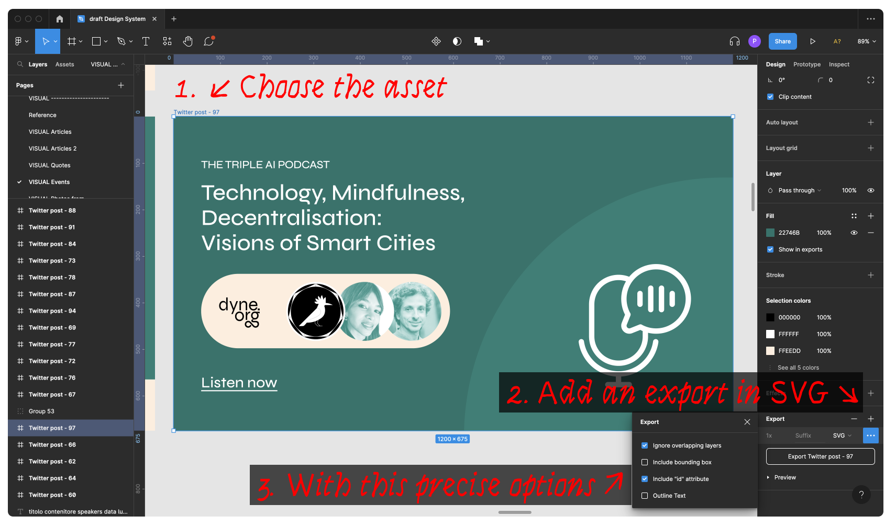

<!--
SPDX-FileCopyrightText: 2022 Dyne.org foundation
SPDX-FileCopyrightText: 2022 Puria Nafisi Azizi <puria@dyne.org>

SPDX-License-Identifier: AGPL-3.0-or-later
-->

<p align="center">
  <a href="https://luigi.dyne.org">
    <pre>
────▄████▄▄ 
───▄▀█▀▐└─┐ 
───█▄▐▌▄█▄┘ 
───└▄▄▄▄─┘ 
▄██████████▄ 
▒▒█▄████▄█▒▒ 
──███▀▀███ 
▄███────███▄ 
    </pre>
  </a>
</p>

<h1 align="center">
  Luigi van der Dyne</br>
  <sub>Design tool for hackers</sub>
</h1>


<br><br>

<h4 align="center">
  <a href="#-quick-start">🎮 Quick start</a>
  <span> • </span>
  <a href="#-configuration">🔧 Configuration</a>
  <span> • </span>
  <a href="#-acknowledgements">😍 Acknowledgements</a>
  <span> • </span>
  <a href="#-links">🌐 Links</a>
  <span> • </span>
  <a href="#-contributing">👤 Contributing</a>
  <span> • </span>
  <a href="#-license">💼 License</a>
</h4>


This software is meant for the Dyne.org hackers that want to easily implement assets and follow the new design rules of Dyne.org.

### To use it head your browser to https://luigi.dyne.org/

<details id="toc">
 <summary><strong>🚩 Table of Contents</strong> (click to expand)</summary>

* [Quick start](#-quick-start)
* [Acknowledgements](#-acknowledgements)
* [Links](#-links)
* [Contributing](#-contributing)
* [License](#-license)
</details>

***
## 🎮 Quick start

To start using Luigi van der Dyne just https://luigi.dyne.org/

## Adding new formats

### 1. Create a new design function
First, running a command that will ask you a couple of questions to create a new design functions from a base (template, example or blank):

```
yarn new
```
Choose

```
❯ Template
❯ React Image (SVG)
```
And give it a proper name (eg. event_twitter_card, linkedin_banner...), this will be the name of the template asset and the folder in which we now have to work, let's say it's called `listen_to_podcast`

### 2. Insert the layout

So in Luigi everything works in svg ;)
Let's go and find some awesome .svg layouts in our figma projects and export it as shown below:



Options show be as follow:
- [x] Include 'id' attributes
- [ ] Outline text

specially is important to Uncheck **Outline text**

Now export the svg copy the content inside the file and paste it into your new created `functions/listen_to_podcast/index.js`

at line 11-13 
replace
```javascript
  return (
    <svg width={width} height={height}>
      <rect fill={color} width={width} height={height} />
    </svg>
  );
};
```
with
```javascript
  return (
    // The content of the svg exported just previously described as of this guide ;p
    // Something like:
    <svg width="1200" height="675" viewBox="0 0 1200 675" fill="none">
       ...
    </svg>
  );
};
```

### 3. Run the app locally

Now in the root project run the server with the following command

```
yarn dev
```
head your browser to http://localhost:3000 so you can already see your new template and to see that in actions


### 4. Define the inputs

Add the control inputs as describe in [add-an-input](https://mechanic.design/docs/v2.0.0-beta.9/#add-an-input) if you have problems with images please refer to this issue https://github.com/designsystemsinternational/mechanic/issues/130 or take inspiration on how I did it on [./functions/event-card/index.js](./functions/event-card/index.js)

### 5. Replace placeholders with inputs

Now that you defined the inputs you can replace the variable name you decided for the inputs inside the svg, search the text / images you want to replace and put the variable names like:

```
{title}
```

**[🔝 back to top](#toc)**

***
## 😍 Acknowledgements


Copyleft (ɔ) 2022 by [Dyne.org](https://www.dyne.org) foundation, Amsterdam

Designed, written and maintained by Puria Nafisi Azizi aka [@pna](https://twitter.com/pna).

Special thanks to:
- @Jaromil that did need a simple tool and is not able to use crappy complicated software design tools
- Tomato 🍅 and Franziska von Guten for the hard creative work, the asset templates and the design rules
- @bbtgnn to point me to [mechanid.design](https://mechanic.design/)

**[🔝 back to top](#toc)**

***
## 🌐 Links

https://luigi.dyne.org/

https://github.com/designsystemsinternational/mechanic


**[🔝 back to top](#toc)**

***
## 👤 Contributing

Please first take a look at the [Dyne.org - Contributor License Agreement](CONTRIBUTING.md) then

1.  🔀 [FORK IT](../../fork)
2.  Create your feature branch `git checkout -b feature/branch`
3.  Commit your changes `git commit -am 'Add some fooBar'`
4.  Push to the branch `git push origin feature/branch`
5.  Create a new Pull Request
6.  🙏 Thank you


**[🔝 back to top](#toc)**

***
## 💼 License
    Luigi van der Dyne - Design tool for hackers
    Copyleft (ɔ) 2021 Dyne.org foundation, Amsterdam

    This program is free software: you can redistribute it and/or modify
    it under the terms of the GNU Affero General Public License as
    published by the Free Software Foundation, either version 3 of the
    License, or (at your option) any later version.

    This program is distributed in the hope that it will be useful,
    but WITHOUT ANY WARRANTY; without even the implied warranty of
    MERCHANTABILITY or FITNESS FOR A PARTICULAR PURPOSE.  See the
    GNU Affero General Public License for more details.

    You should have received a copy of the GNU Affero General Public License
    along with this program.  If not, see <http://www.gnu.org/licenses/>.

**[🔝 back to top](#toc)**
